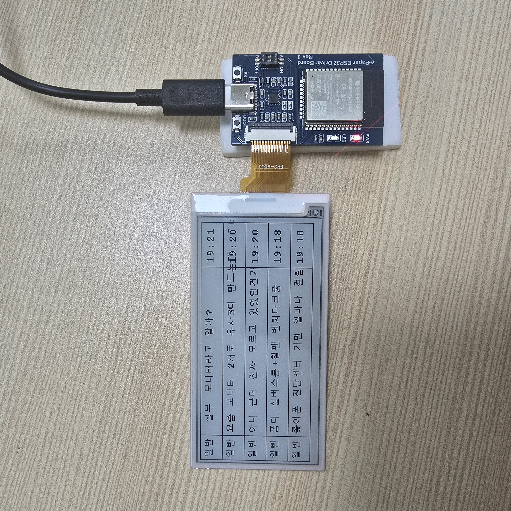

# SFFgallery-scraper
인터넷 커뮤니티에서 세일 목록을 찾기 위해 여러번 접속 하는 것이 번거로웠기 때문에 ESP32를 통해 글 목록을 출력해주는 패널을 제작
## 기능
#### 서버
BeautifulSoup와 json을 사용해 특정 웹사이트([sff갤러리 핫딜게시판](https://gall.dcinside.com/mgallery/board/lists/?id=sff&sort_type=N&search_head=100&page=1))의 글 목록을 업데이트해 최신 5개의 글 목록(제목)을 .json 파일로 저장하거나 'data/'의 .json 파일을 읽어옴
#### 단말
ESP32에 전자잉크 패널을 연결해 5분간격(새로고침 주기 변경 가능)으로 글 목록을 업데이트 및 출력하도록 함.  
ESP32와 전자잉크 패널의 경우 WaveShare의 [e-paper ESP32 driver board](https://www.waveshare.com/wiki/E-Paper_ESP32_Driver_Board)와 [3.5" 전자잉크패널(384*184)](https://www.waveshare.com/3.5inch-e-paper-module-g.htm) 사용  
e-paper의 가이드는 [이쪽](https://www.waveshare.com/wiki/3.5inch_e-Paper_Module_(G))에서 확인
## 문제 및 해결
#### 문제
1. 가이드 파일의 경우 ASCII코드의 sfont와 일부 한자의 cfont 파일만 존재, 한글을 출력하기 위해서는 한글 cfont가 필요.  
2. 한글 전체의 cfont(16pt)의 경우 약 2MB로 ESP32의 SRAM 크기인 520KB를 초과함.
3. 나눔고딕의 cfont 변환 이후 ASCII 문자들의 높이가 절반으로 줄어드는 문제 발생.
#### 해결
1. cfont는 비트맵 폰트 기반으로 만들 수 있기 때문에 쉽게 구할 수 있는 트루타입폰트(.ttf)를 비트맵폰트로 변환이 필요하다. [이곳](https://www.angelcode.com/products/bmfont/)에서 비트맵 폰트 변환을 한 뒤 python을 통해 비트맵->cfont로 변환해준다.  
2. 전체 한글 파일을 사용하지 않기 때문에 BeautifulSoup를 통해 글 제목에서 사용된 글자들(커뮤니티 1~100페이지 글 제목 크롤링)을 추출 후 유니코드로 변환해 bmfont 파일의 스냅샷을 수정해 비트맵 폰트를 생성
3. ASCII 문자만 사용하는 sfont의 비트맵 데이터를 나눔고딕 cfont 파일에 덮어씌움
## 결과물
(핫딜 외 다른 게시판을 볼 수 있도록 한 결과물)

